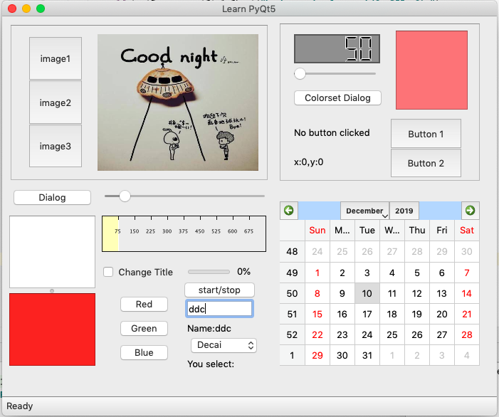

## 具体教程参考文章：
- [一个例子入门pyqt5,中文文档](https://www.dpsdp.com/archives/pyqt5_learning.html)

## 本教程简单介绍

完成后的gui窗口如下，通过此次学习可以了解pyqt5的这些基础知识：
- 一些基础控件的使用
- 信号与槽函数的使用
- 自定义控件的构造与使用
- 菜单栏
- 布局管理
以及一些常用的基础知识

完成后的样品页面如下：

